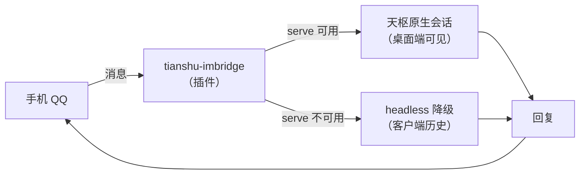

# tianshu-imbridge

[](https://github.com/KhalilYamber/tianshu-imbridge/releases)
[](LICENSE)

手机 QQ 的消息直达天枢，天枢的回复直接回到 QQ。每个 QQ 对话线在天枢桌面端以「原生会话」的形态存在：多轮上下文由服务端维护，会话在桌面端会话目录里可见、可回看、可继续。

五个内置命令（工作区 / 会话 / 历史）在 QQ 里即发即用，由插件本地处理、不消耗模型调用；普通消息则走天枢的完整能力（文件、命令、任务——取决于你的天枢配置）。

## 特性

- **双向消息桥**：QQ ↔ 天枢，无中间转接
- **原生会话**：一条 QQ 对话线 = 一个桌面端可见的天枢会话，多轮上下文由服务端维护
- **命令层**：`/workspacelist`、`/workspace`、`/sessions`、`/session`、`/history`、`/help`——本地处理、零模型调用、带首次使用提示
- **双模式**：serve 环境自动走原生会话；TUI / 独立进程自动降级 headless
- **交互转发**：天枢的提问卡片与审批请求会转发到 QQ——回复编号 / 「批准·拒绝」即可作答
- **工具**：`im_status`（运行状态报告）、`im_send`（主动推送通知到 QQ）
- **单依赖**：运行时仅 `@tencent-connect/qqbot-nodejs`（官方 SDK），其余全部使用 Node 内置模块

## 工作方式



- **serve 原生会话（优先）**：插件运行在天枢 serve 进程内，每条 QQ 对话线绑定一个原生会话——首条消息建会话，后续消息送入同一会话，回复经事件流收集
- **headless 降级（TUI / 独立进程）**：回退到单次调用 + 客户端历史注入（默认保留最近 8 条往来）

## 安装

前置要求：

- 天枢桌面端（已在 Tianshu 3.24.0 / Windows 实测）
- 一个 QQ 开放平台机器人（AppID 与 AppSecret）

步骤：

1. 从 [Releases](https://github.com/KhalilYamber/tianshu-imbridge/releases) 下载最新版（或克隆本仓库），放入插件目录：`<RIVET_HOME>\plugins\tianshu-imbridge\`
2. 在插件目录安装依赖：`npm install --omit=dev`
3. 配置凭据（见下节）
4. 重启天枢桌面端

重启后插件自动连接 QQ 并上线。想确认状态：让天枢调一次 `im_status`。

## 配置

配置文件位置：`<RIVET_HOME>\imbridge\config.json`

```json
{
  "appId": "你的 AppID",
  "appSecret": "你的 AppSecret",
  "ownerUserOpenid": "你的 openid（强烈建议填写，见安全须知）",
  "workspace": "（可选）QQ 会话默认进入的工作区绝对路径"
}
```

| 字段 | 必填 | 说明 |
| --- | --- | --- |
| `appId` | 是 | QQ 开放平台机器人的 AppID |
| `appSecret` | 是 | 机器人的 AppSecret |
| `ownerUserOpenid` | **强烈建议** | 你的用户 openid；配置后私聊仅响应你本人（不填 = 私聊全部放行） |
| `workspace` | 否 | QQ 会话默认进入的工作区绝对路径；留空则由插件自动指派 |
| `enabled` | 否 | 设为 `false` 可临时停用 QQ 连接（默认启用） |

也支持环境变量（临时测试用）：`TIANSHU_IM_QQ_APPID` / `TIANSHU_IM_QQ_SECRET`（环境变量优先于配置文件）。

凭据永不写入源码、永不进日志；`im_status` 只显示脱敏后的 appId。

## 命令（在 QQ 里直接发）

命令**由插件本地处理，不送给模型**（命中命令时对模型的调用次数为 0）。命令必须是消息的**第一个词**，命令词不分大小写；以斜杠开头的路径（如 `/home/user/x`）不会被误判成命令。**忘了有哪些命令？发 `/help` 即可。**

| 命令 | 别名 | 参数 | 作用 |
| --- | --- | --- | --- |
| `/workspacelist` | `/wsl`、`/workspaces` | 无 | 列出可选工作区；编号即 `/workspace` 的取值 |
| `/workspace` | `/ws` | `<编号或绝对路径>` | 切换工作区：在目标工作区预建会话并换绑，下一条消息进新会话 |
| `/sessions` | `/sessionlist` | `[工作区编号] [--limit N]` | 列出会话（标题 + 编号；默认 10 条，最多 30 条） |
| `/session` | — | `<编号或会话 ID>` | 把这条 QQ 对话线绑定到指定会话 |
| `/history` | — | `[N]` | 回看当前绑定会话的最近 N 条消息（默认 3，上限 20） |
| `/help` | `/h` | `[命令名]` | 看命令说明；不带参数看全部 |

示例：

```
/workspacelist
/workspace 2
/sessions 2 --limit 5
/session 3
/history 5
/help history
```

命令行为要点：

- **工作区枚举根** = 配置项 `workspace` 的父目录（隐藏项与非目录除外）；工作区以目录为准，没有额外的注册表
- `/sessions` 的编号与 `/session <编号>` 共用同一份清单与排序
- `/history` 的数量在插件本地校验（1..20，缺省 3）；非法值按默认处理并在正文里说明
- 第一次用到某条命令时，回执末尾附该命令的完整用法；此后只附一行提示
- 若运行环境没有 serve 通道（TUI / 独立进程），除 `/workspacelist` 外的命令会明确提示「降级模式」，不会静默失败

## 交互转发（提问与审批）

天枢需要您做选择时，QQ 侧会同步收到，离开电脑也能作答：

- **提问**（天枢的「选择题」）：问题与选项以编号列表转发到 QQ，回复编号（如 `1`）或直接文字作答即可；
- **审批**（敏感操作确认）：请求实时转发，回复「批准」或「拒绝」继续——回合在服务端原地等您，不再干等到超时。

作答只认您本人（`ownerUserOpenid`）；桥不会自动批准任何请求。若请求几秒内已在电脑端处理，QQ 侧不会被打扰。

## 工具（天枢侧调用）

| 工具 | 用途 |
| --- | --- |
| `im_status` | 报告运行模式（`serve-native` / `headless`）、QQ 连接、会话映射数、收发统计 |
| `im_send` | 主动给 owner 发 QQ 消息（完成通知等）；目标取 `ownerUserOpenid`，缺省回落到最近一次入站发送者 |

## ⚠️ 安全须知

- **务必配置 `ownerUserOpenid`**：不配置时，任何能找到这个 bot 的人都能给你的天枢发指令——而它握着一个完整的 agent（文件与命令工具）。配置后私聊仅响应你本人；群聊默认要求 @ 机器人。
- **同一个 bot 不要在多处同时连接**（例如与 DSH 侧的连接并存）：QQ 网关允许重复连接，但事件分发行为没有官方定义，同一条消息可能被两端同时处理。两边都要用的场景：申请第二个 bot。
- **`im_send` 的 `targetId` 目前不设白名单**：低频自用无碍；公开场景下建议自行收紧。
- 凭据只放 `<RIVET_HOME>\imbridge\config.json`，不要提交到任何仓库。

## 已知限制

- `im_status` 顶层 `connection` 显示字段与内部实时状态轻微不同步（非阻塞）
- 群聊（`group:`）路径尚未实机验证

## 开发

- 运行测试：`node --test`（当前 249 例）
- 模块地图：`index.js`（入口，保持轻量）· `lib/bridge.mjs`（消息桥）· `lib/serve-client.mjs`（原生会话通道）· `lib/command*.mjs`（命令层）· `lib/qq/`（连接与配置）· `test/`（单元测试）· `tools/`（e2e 与探针）
- 设计依据与实测记录：`docs/command-mapping.md`、`docs/prior-art-survey.md`
- 设计约束：入口保持轻量（顶层 import 链失败会导致插件被静默跳过）、凭据零泄漏、不硬编码个人路径

## 致谢与许可

- [@xmanrui/dsh-im](https://github.com/xmanrui/dsh-im)：QQ 渠道设计参考（`lib/vendor/` 为其移植参考材料）
- @tencent-connect/qqbot-nodejs：腾讯 QQ 开放平台官方 Node.js SDK

本项目以 [MIT 许可](LICENSE) 发布；第三方组件声明见 THIRD_PARTY_NOTICES.md。
