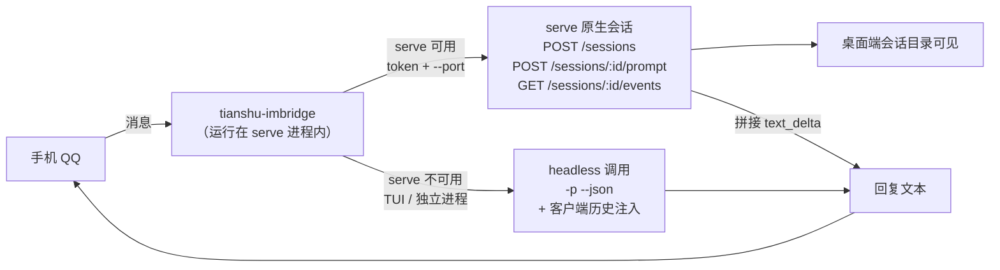

# tianshu-imbridge

天枢（Tianshu Harness）的 IM 插件（QQ 渠道，开发中）。

目标：手机 QQ 的消息直接进入天枢，天枢的回复直接回到 QQ，中间不经过 DSH 转接。

## 当前状态

- 阶段：**W5 完成 · 真机验收通过**（2026-09-24 11:13）
- W0 常驻验证 / W1 骨架 / W2 连接层 / W3 消息桥 / W4 部署验收 / **W5 原生会话改造**：全部完成
- **QQ 真机连接：已验证**（真实 bot 凭据；收发双向打通）
- **常驻验收通过**：天枢重启后插件正式上线——`im_status` 实证：
  连接 `connected`、收到消息 1 条、处理 1 条、回复 1 条、零失败
- **W5 目标**：让 QQ 对话以「桌面端原生会话」的形态出现。每个 QQ 对话线绑定一个
  天枢 serve 原生会话，该会话在桌面端会话目录里可见，上下文由服务端维护（与 dsh-im 同构）
- **W5 离线验证**：`tools/e2e-serve-session.mjs` 对隔离 serve 实例实测通过——
  首条建成原生会话、次条复用同一会话并正确引用上文、`serveSessionsCreated=1`、
  `MODE=serve-native`、`E2E: OK`
- **W5 真机验收通过**（2026-09-24 11:13，重启后首条 QQ 消息）。证据链：
  - 插件启动日志：`消息桥就绪（模式=serve-native，工作区=D:\path\to\bridge天枢默认，serve=http://127.0.0.1:43324）`
  - 消息流：`[bridge] serve 新建会话 2026092437d1b4` → `serve → 会话（13 字）` → `serve ← 回复已发送（9 字）`
  - 桌面端会话目录多出该会话，标题 `QQ: 请说"现在是 11:13"`，工作区 `bridge天枢默认`，
    会话内一轮问答完整（用户消息 → 回复「现在是 11:13」）
  - 绑定表落盘：`imbridge/session-map.json` → `{"c2c:D939…4B0（脱敏）": "2026092437d1b4997aec"}`
  - 由此证实的原设计关键假设：插件运行在 serve 进程内时**能**读到 `RIVET_SERVER_TOKEN`
    （此前为推断、未实测）；端口来自 argv，每次启动都变（本机实测两次：26177 / 43324）
- 工作区：QQ 会话默认进入配置项 `workspace`（当前为 `D:\path\to\bridge天枢默认`）
- 测试：**单元测试全绿**（`node --test`，当前 249 例）
- **红队审查 + 修复**（2026-09-24）：对 serve 通道做对抗测试，修掉四处实跑复现的缺陷——
  ① 会话 404 重建后沿用死游标（事件被 `e.seq > since` 全过滤 → 空转成假超时）；
  ② 快照接口任何非 200 都被当成「会话已删除」→ 一次 500 就静默清掉持久绑定；
  ③ 快照缺 `lastSeq` 时退回 0 → 上一轮内容被重放进聊天窗口；
  ④ 轮询无请求超时 → 一条不响应的响应会永久卡死该 QQ 会话线。
  另外：轮询期单次网络抖动不再毁掉整轮回复；超时但有半截文本会如实标注「可能不完整」；
  非 200（401/500）不再被吞成「没有新事件」；serve 判定收紧为「argv 里确有 `serve` 子命令」，
  免得 headless 下用户消息正文里的 `--port=` 被当成端口。
- **ponytail 过度设计审计**（2026-09-24）：删掉两处零生产调用者的死代码——`serve-client.mjs`
  的 `extractReplyText` 导出、`tianshu.mjs` 的 `resumeId` 选项与 `-r` 分支。
  详见下方「未采纳的简化」一节。
- **im_status 悬空引用修复**（2026-09-24）：工具曾引用未定义的 `sessionMapCache`，调用必抛
  ReferenceError；已改为读绑定表落盘条目数（`session-map.json`），并补入口级回归测试
  `test/plugin-entry.test.mjs`。
- 已知小项（非阻塞）：`im_status` 顶层 `connection` 显示字段与内部实时状态轻微不同步
- 社区查重：完成，见 `docs/prior-art-survey.md`（无等价轮子；DSH 侧有先例）
- **命令层（工作区 / 会话 / 历史）**：`/workspacelist`、`/workspace`、`/sessions`、`/session`、`/history`
  五个命令已接进消息桥（命中命令时不调用模型）。依据与实测记录：`docs/command-mapping.md`、
  `docs/research-notes/serve-endpoints-20260924.txt`、`serve-event-reconstruction-20260924.txt`、
  `transcript-verification-20260924.md`、`history-verification-20260924.md`。
  离线验收：单测 249 例全绿；`/history` 对隔离实例 e2e 10/10。**手机 QQ 真机走查待办**。

## ⚠️ 安全边界：`ownerUserOpenid` 建议必填

QQ 侧未配置 `ownerUserOpenid` 时**默认放行所有私聊**，而机器人背后是一个握着文件与命令工具的
天枢 agent。也就是说，任何能找到这个 bot 的人都能驱使它干活。**请把它当必填项**：
配置后私聊仅响应你本人（群聊另由 `mentionGate` 要求 @bot 把关）。

出站方向同样值得留意：`im_send` 工具的 `targetId` 目前不设白名单，群聊里的一段提示注入
理论上足以让机器人把内容推给任意 openid。低频自用无碍，公开使用前建议收紧。

## 未采纳的简化（ponytail 审计结论）

审计判定插件自身约 1,400 行源码对它所做的事并不臃肿，可下刀处集中在死重与「只为测试活着」的选项：

- `lib/vendor/`（约 5,988 行 js/ts + 约 1,063 行随附文档）：**决定保留**（2026-09-24 主人拍板）。
  它零代码引用者（SDK 走 node_modules，分片是本仓库自己写的），作为 dsh-im 的移植参考材料存在；
  将来若不再需要这份参照，删掉并在文档留一条上游链接即可。
- `lib/qq/connection.mjs` 的六档退避重试梯：保留。SDK 自带网关级重连，但 `bot.start()` 因
  凭据/启动失败而 reject 时不会自愈，外层这层是必要的；换成固定间隔重试反而更差。
- `conversationDirName` 的 sha256：保留。改成可读的字符净化会变更已落盘的目录名，
  而 sha256 无碰撞，收益不值这个迁移代价。

## 会话形态：双模式（W5 改造）

插件按运行环境自动选路，两条路径对外行为一致（都回答 QQ、都支持多轮）：



- **serve 原生会话模式（优先）**：插件与 serve 同进程运行，可从
  `process.env.RIVET_SERVER_TOKEN` 与 `--port`（argv）探测到本机 serve。
  每个 QQ 对话线（`c2c:<openid>` / `group:<gid>`）在 `imbridge/session-map.json` 里
  绑定一个 serve 会话：首条消息 `POST /sessions` 建会话（桌面端立刻可见），
  后续消息 `POST /sessions/:id/prompt`，回复从 `GET /sessions/:id/events` 轮询收集。
  **多轮上下文由会话自身维护**，客户端不再注入历史。
- **headless 降级模式**：非 serve 环境（TUI、独立脚本）回退到 `-p --json`
  一次调用 + `lib/history.mjs` 客户端历史，行为与 W3 相同。

回合完成判定：`turn_complete` 且 `data.isFinal !== false`，到达后留 3 秒宽限
（天枢可能在同一 prompt 下开启自动补救轮，宽限期内出现新文本则撤销完成、继续收集）。
轮询间隔 1.2 秒，总超时 180 秒（与 headless 对齐）。会话失效（404）时清掉映射并重建。

## 多轮对话实现（headless 路径）

实测（2026-09-24）：天枢 headless（`-p`）的会话不写「可回放消息文件」，
`-r/--resume` 会静默降级为新会话——服务端续接在 headless 场景不可用。
因此 headless 路径由 `lib/history.mjs` 在客户端承载多轮：每会话保留最近往来
（默认 8 条 / 6000 字符预算），调用时拼入 prompt。行为确定、与天枢版本解耦；
代价是历史随输入计入 token（由预算控制）。

serve 路径不需要这一层：会话本身连续，服务端维护上下文。

## 目录

- `package.json` — 天枢插件 manifest（`tianshu` 字段）+ SDK 依赖
- `index.js` — 插件入口（顶层轻量；懒加载连接与桥；模式探测；im_status / im_send 工具）
- `lib/serve-client.mjs` — serve 会话客户端（环境探测 / 建会话 / 派发 prompt / 事件流收回复）
- `lib/qq/config.mjs` — 凭据与配置读取（env + config.json，零泄漏）
- `lib/qq/connection.mjs` — QQ 连接器（官方 SDK 封装：状态机 / 退避重试 / 去重 / 会话持久化）
- `lib/bridge.mjs` — 消息桥（双模式：serve 原生会话 / headless 降级）
- `lib/history.mjs` — 多轮对话历史（裁剪 + 持久化 + prompt 组装；headless 路径用）
- `lib/command.mjs` — 命令解析与**命令说明的唯一文案源**（`COMMAND_USAGE`：/help 卡片与首次提示都取它）
- `lib/command-hints.mjs` — 「首次使用某命令」的记忆（落盘 `command-hints.json`；空文件参数则退化为内存版）
- `lib/command-handlers.mjs` — 命令处理器注册表与分发（每个处理器自行回执）
- `lib/workspaces.mjs` — 工作区枚举（`/workspacelist` 的取数层）
- `lib/sessions.mjs` — 会话清单取数与格式化（`/sessions`、`/session` 的取数层）
- `lib/transcript.mjs` — 事件流 → 消息序列还原 + `/history` 排版（纯逻辑）
- `lib/tianshu.mjs` — 天枢 headless 调用封装（组装 / 解析 / 超时）
- `lib/reply.mjs` — 回复分片规划（4500 字符/条、被动回复上限、代理对安全）
- `test/` — 单元测试（`node --test`；含红队缺陷的回归用例）
- `tools/qq-connect-smoke.mjs` — QQ 连接冒烟（独立运行，收+发双向验证）
- `tools/e2e-local-bridge.mjs` — 本地桥全链路演练（headless 路径，两轮多轮验证）
- `tools/e2e-serve-session.mjs` — serve 原生会话链路 e2e（建会话 / 复用 / 上下文连续）
- `tools/probe-endpoints.mjs` / `tools/probe-reconstruct.mjs` — 端点半实测 / 事件还原可行性探针
- `tools/probe-transcript.mjs` — 真实事件档复算 + `/history` 排版样本（可带 `--since` 切片）
- `tools/e2e-command-history.mjs` — `/history` 对真实 serve 实例的边界 e2e
- `docs/` — 验证记录、查重报告、真机测试引导、运行时逆向笔记、**红队审查报告**（`docs/red-team-report.md`）
- `lib/vendor/` — dsh-im QQ 渠道与腾讯 SDK 的移植参考材料（MIT）

## 命令（QQ 侧）

QQ 里发命令即用：命令**由插件本地处理，不送给模型**（命中命令时对模型的调用次数为 0）。
命令词不分大小写；命令必须是消息的**第一个词**（「你好 /history」按普通消息处理）。
以斜杠开头的路径（`/home/user/x`）不会被误判成命令。**忘了有哪些命令？发 `/help` 即可。**

| 命令 | 别名 | 参数 | 作用 |
| --- | --- | --- | --- |
| `/workspacelist` | `/wsl`、`/workspaces` | 无 | 列出可选工作区；编号即 `/workspace` 的取值 |
| `/workspace` | `/ws` | `<编号或绝对路径>` | 切换工作区：在目标工作区**预建**会话并换绑，下一条消息进新会话 |
| `/sessions` | `/sessionlist` | `[工作区编号] [--limit N]` | 列出会话（标题 + 编号；默认 10 条，最多 30 条） |
| `/session` | — | `<编号或会话 ID>` | 把这条 QQ 对话线绑定到指定会话 |
| `/history` | — | `[N]` | 回看当前绑定会话的最近 N 条消息（默认 3，上限 20） |
| `/help` | `/h` | `[命令名]` | 看命令说明；不带参数看全部 |

示例：

```
/workspacelist
/workspace 2
/workspace D:\path\to\coding
/sessions 2 --limit 5
/session 3
/history 5
/help
/help history
```

### 口径与边界

- **工作区枚举根** = 配置项 `workspace` 的**父目录**；只排除隐藏项（`.` 开头）与非目录。
  天枢没有工作区注册表，目录即真理。工作区内部自带的 `.rivet/` 不会导致它被误杀
  （每个工作区都有自己的 `.rivet/`）。未配置 `workspace` 时给一句可读提示，不猜、不扫。
- **`/sessions` 的编号**与 `/session <编号>` 共用同一份清单与排序（`updatedAt` 降序），不各排各的。
- **`/history` 数量**在插件本地校验为 1..20 的整数，缺省 3；非法值回落到默认值**并在正文里说明**。
  用户输入永远不会被透传成接口游标（固定用 `since=0` 取尾部窗口）。
- **`/history` 排版**：单条默认上限 800 字，条数多时按「总字数预算 1.2 万」自动压缩每条（下限 300 字）并说明；超出即截断并注明原字数；未正常收尾的一轮标「没有正常收尾」；
  运行期间排队送入的输入标「运行中排队送入」；更早内容不在宿主返回的窗口内时会单独说明。
- **默认 3 与上限 5 这两个数字**借自 dsh-im 的形；其源码未随本仓库分发，仓库内无法复核。
- **命令提示（可发现性）**：第一次用到某条命令时，回执末尾附上该命令的用法与例子，并把「已教过」记进
  `<RIVET_HOME>/imbridge/command-hints.json`；此后只附一行「`/help` 看全部命令」。未知命令回的就是帮助卡片，
  不再重复附提示。处理器没有回执时什么都不发（提示不单独成条）。帮助文案只有一份来源（`lib/command.mjs` 的
  `COMMAND_USAGE`），`/help` 卡片与首次提示都从它生成。

### 降级行为（非 serve 环境：TUI / 独立进程）

| 命令 | 降级时的行为 |
| --- | --- |
| `/workspacelist` | 可用（纯文件系统枚举） |
| `/workspace` | 回「当前是降级模式（没有 serve 会话通道），工作区不可切换；绑定保持原样」 |
| `/sessions`、`/session`、`/history` | 各自的「降级模式」提示，不静默 |
| 未知命令 | 回一条帮助（列出当前已注册的命令），**不送模型** |

### 失败处理

- 命令处理器抛错只回一句人话，**不冒泡到天枢本体**；命令回执与模型回执分开计数
  （`im_status` 的 `commands` / `commandsFailed`）。
- `/workspace`、`/session` 的一切失败路径都**先回绝、后不动绑定**；`/history` 读不动时绑定同样保持原样
  （清理绑定是消息桥遇到 404 时的职责）。


## 工具

| 工具 | 用途 |
| --- | --- |
| `im_status` | 报告阶段、模式（`serve-native` / `headless`）、QQ 连接、会话映射数、收发统计 |
| `im_send` | 主动给 owner 发 QQ 消息（完成通知等）。目标取 `ownerUserOpenid`，缺省回落到最近一次入站发送者 |

## 配置凭据

两种方式（环境变量优先）：

1. 数据目录配置文件 `<RIVET_HOME>\imbridge\config.json`（推荐，分享友好）：

   ```json
   {
     "appId": "你的 AppID",
     "appSecret": "你的 AppSecret",
     "ownerUserOpenid": "（可选）你的 openid：配置后私聊仅响应你",
     "workspace": "（可选）QQ 会话默认进入的工作区绝对路径"
   }
   ```

2. 环境变量 `TIANSHU_IM_QQ_APPID` / `TIANSHU_IM_QQ_SECRET`（临时测试用）

凭据永不写入源码、永不进日志（`im_status` 只显示脱敏 appId）。

## 部署到天枢（开发机）

1. 复制到插件目录：把本目录复制为 `<RIVET_HOME>/plugins/tianshu-imbridge/`
   （本机为 `<RIVET_HOME>\plugins\tianshu-imbridge\`），
   并在插件目录执行 `npm install --omit=dev`（安装 `@tencent-connect/qqbot-nodejs`）。
2. 或安装 API（可热加载）：`POST /plugins/install`，
   body：`{"source":{"kind":"local","path":"<本目录绝对路径>"},"confirm":true}`
3. **插件在 serve 启动时加载**：复制文件不会让新版本生效，需要**重启天枢桌面端**
   （或走第 2 条的安装 API 热加载）。重启后看 `im_status` 的 `mode` 字段：
   `serve-native` 表示原生会话通道已启用。

## ⚠️ 同一 bot 的连接关系（重要）

QQ 网关**允许**同一 bot 多连接（官方分片设计，session 配额 1000/天），但多个连接对事件的
获取行为未在文档中定义（同分片重复连接可能分流或重复投递）。**使用本插件时，建议停用
同一 bot 在 DSH 侧的 dsh-qq 连接**（反之亦然），避免同一条消息被两端同时处理。
"两边都要用"的场景：申请第二个 QQ bot。

## 红线（设计约束）

- 不硬编码个人路径（分享给他人时路径、工作区、凭据一律从配置读）
- 凭据零泄漏：secret 走环境变量或独立配置文件，永不入源码、永不进日志
- 保留 dsh-im / 腾讯 SDK 的 MIT 版权声明（`lib/vendor/` 为移植参考材料）
- 入口保持轻量（顶层 import 链失败会导致插件被静默跳过）
